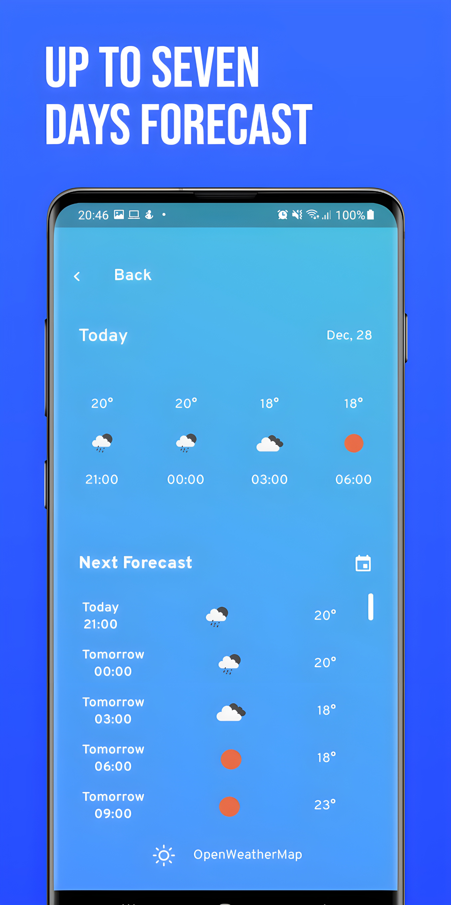

# weather-app

<p>
    
    
    
    
</p>

Weather app is a design implementation of [Weather Forecast App](https://www.figma.com/community/file/885501292477669105)" designed by [Maulana Farhan Najib](https://www.figma.com/@maulana).

Weather App is an Android-only application, built with Flutter, as a study of Flutter. I have tried to collect all features of the original design, but some I did not found useful, like notifications, which I replaced with a button to show more info about the weather. It uses SQLite to store recent searches and favorite places.

## Table of Contents
- [weather-app](#weather-app)
  - [Table of Contents](#table-of-contents)
  - [Features](#features)
  - [To-Do](#to-do)
  - [Directory Structure](#directory-structure)
  - [My process](#my-process)
    - [Built with](#built-with)
    - [Packages I'm using](#packages-im-using)
  - [How to use](#how-to-use)
    - [Requirements](#requirements)
    - [Building](#building)
  - [Pull Requests](#pull-requests)
  - [Created & Maintained By](#created--maintained-by)

## Features
- ✅ Detailed forecast
- ✅ Up to seven days forecast
- ✅ Coverage from anywhere
- ✅ Multi-language (JA, PT, EN, ES)
- ✅ Custom icons for each weather condition

## To-Do
- [ ] Implement Hive DB
- [ ] Create settings page
- [ ] Implement search by speech
- [ ] Add more languages
- [ ] Dark mode

## Directory Structure
```
lib/
├── main.dart
├── database/
│   └── database.dart
├── l10n/
│   ├── app_en.arb
│   ├── app_es.arb
│   ├── app_ja.arb
│   └── app_pt.arb
├── models/
│   ├── details_arguments.dart
│   └── place.dart
├── pages/
│   ├── forecast_page.dart
│   ├── home_page.dart
│   ├── map_page.dart
│   ├── no_gps_page.dart
│   └── search_page.dart
├── services/
│   ├── geo_api.dart
│   └── weather_api.dart
├── utils/
│   └── utils.dart
└── widgets/
    ├── card_forecast.dart
    ├── card_info.dart
    └── card_weather.dart
```

## My process

### Built with

- Flutter
- OpenWeatherMap API
- SQLite database
- Shared Preferences
- Google Maps API
- Google Place API

### Packages I'm using
- weather: [link](https://pub.dev/packages/weather)
- google_fonts: [link](https://pub.dev/packages/google_fonts)
- geolocator: [link](https://pub.dev/packages/geolocator)
- material_floating_search_bar: [link](https://pub.dev/packages/material_floating_search_bar)
- sliding_sheet: [link](https://pub.dev/packages/sliding_sheet)
- weather_icons: [link](https://pub.dev/packages/weather_icons)
- intl: [link](https://pub.dev/packages/intl)
- flutter_dotenv: [link](https://pub.dev/packages/flutter_dotenv)
- latlong2: [link](https://pub.dev/packages/latlong2)
- geocoding: [link](https://pub.dev/packages/geocoding)
- google_maps_flutter: [link](https://pub.dev/packages/google_maps_flutter)
- google_place: [link](https://pub.dev/packages/google_place)
- sqflite: [link](https://pub.dev/packages/sqflite)
- path: [link](https://pub.dev/packages/path)
- dropdown_search: [link](https://pub.dev/packages/dropdown_search)
- shared_preferences: [link](https://pub.dev/packages/shared_preferences)
- sizer: [link](https://pub.dev/packages/sizer)
- flutter_localizations: [link](https://pub.dev/packages/flutter_localizations)

## How to use
### Requirements
Before beginning, make sure you have installed [Flutter](https://docs.flutter.dev/get-started/install).

### Building
Clone the repo to your local computer
> $ git clone https://github.com/samuel-s-marques/weather-app

Access the project's folder in your cmd/terminal
> $ cd weather-app

Fulfill the .env.example file with your API keys and remove the .example from the file
```
API_KEY= openweather map api key
GOOGLE_PLACE_API_KEY= google place api key
```

Add the following line on android/local.properties file
```
MAPS_API_KEY= your google maps api key
```

For OpenWeatherMap API, check this [link](https://openweathermap.org/api). For Google APIs, check this [link](https://developers.google.com/maps/documentation/places/web-service/get-api-key)

Now you can open the project with VSCode or Android Studio and build it.

## Pull Requests
I welcome and encourage all pull requests. It usually will take me within 24-48 hours to respond to any issue or request.

## Created & Maintained By
[Samuel Marques](https://github.com/samuel-s-marques) ([LinkedIn](https://www.linkedin.com/in/samuel-s-marques/)).

"[Weather Forecast App](https://www.figma.com/community/file/885501292477669105)" by [Maulana Farhan Najib](https://www.figma.com/@maulana) is licensed under [CC BY 4.0](https://creativecommons.org/licenses/by/4.0/).

Mockups provided by [Previewed](https://previewed.app/).
